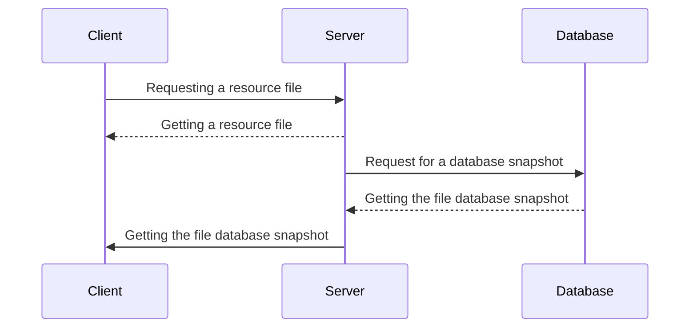

# :fire: Snapshot

##### _Snapshot anything quickly and efficiently_


>Utility to create snapshots of files and database of selected resources.

Snapshot - has both CLI (command-line interface). Snapshot, includes gzip, deduplication. Snapshot creates snapshots of the selected resource at a specified frequency.

The utility will allow:

- create snapshots of files and databases;
- compare pictures;
- request files or directories from created snapshots;
- request an archive of a previously taken snapshot
- download the full resource archive for the selected date.

The first snapshot contains absolutely all files and directories of the project, subsequent snapshots contain only the changed data.
The utility allows you to simplify the process of creating snapshots of multiple projects, with the ability to easily manage previously created snapshots.

### Main

Backup is the process of creating copies of data that can be used to restore information in case of loss or damage. It is important to make regular backups of your data to protect your information from loss due to technical failures, user errors, or cyberattacks.

You can use various methods to create backups, including local storage on hard drives, using cloud services, or creating copies on removable media. It is important to choose the appropriate backup method that suits your organization's requirements.

In addition, it is necessary to determine the frequency of backups and their retention period. The frequency should depend on the importance of the data and how often it changes. Backup storage should also comply with your organization's policies and laws.

It is also important to conduct regular checks of backups to ensure their integrity and the ability to restore data if necessary.

Finally, don't forget about the security of your backups. Backups should be stored in a secure location protected from unauthorized access. In addition, data in backups must be encrypted to protect against information leaks.

### Description of work

```go
go test ./...
go build
```

### List of all available commands

```go
// help
snp -h
// add resource
snp -a site.ru
// edit resource data
snp -e *project ID* *data field name* *new value*
// list all resources
snp -l
// delete the specified resource
snp -d *project ID*
// display all settings of the selected resource
snp -s *project ID*
// create a resource snapshot
snp -c *project ID*
// take snapshot of all projects
snp -cl
// list all available snapshots
snp -ls *project ID*
// request a specific project snapshot
snp -gs *project ID* *snapshot ID*
// request a file or an entire directory from a specific snapshot
snp -gsf *project ID* *snapshot ID* *directory*
// compare two pictures
snp -sc *project ID* *snapshot ID first* *snapshot ID second*
```

### Graphical representation of processes



### Reason for creation

This pet-project was created for educational purposes and with possible future potential to simplify the work of creating backup copies.

## ✨ _Git Flow_ ✨

- git pull - update local repository
- git branch - query the current branch
- git checkout `develop` - go to branch develop
- git checkout -b `feature-detail` - create and switch to a new branch

- branch `main` - release history
- branch `develop` - all functions
- branch `feature` - individual functions

- git push origin develop - pour into the thread

[Clue](https://www.atlassian.com/ru/git/tutorials/comparing-workflows/gitflow-workflow)