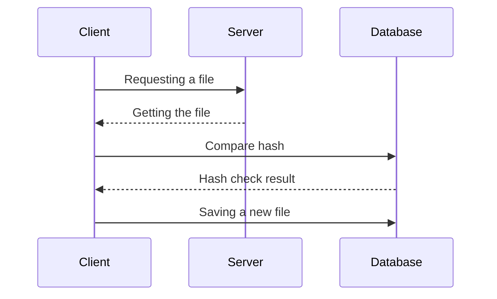

# :fire: Snapshot

##### _Snapshot anything quickly and efficiently_


>Utility to create snapshots of files and database of selected resources.

Snapshot - has both CLI (command-line interface). Snapshot, includes gzip, deduplication. Snapshot creates snapshots of the selected resource at a specified frequency.

The utility will allow:

- tracking changes;
- creating snapshots of only changed data;
- download the full archive of the resource for the selected date.

### Description of work

```go
go test ./...
go build
```



## ✨ _Git Flow_ ✨

- git pull - update local repository
- git branch - query the current branch
- git checkout `develop` - go to branch develop
- git checkout -b `feature-detail` - create and switch to a new branch

- branch `main` - release history
- branch `develop` - all functions
- branch `feature` - individual functions

[Clue](https://www.atlassian.com/ru/git/tutorials/comparing-workflows/gitflow-workflow)