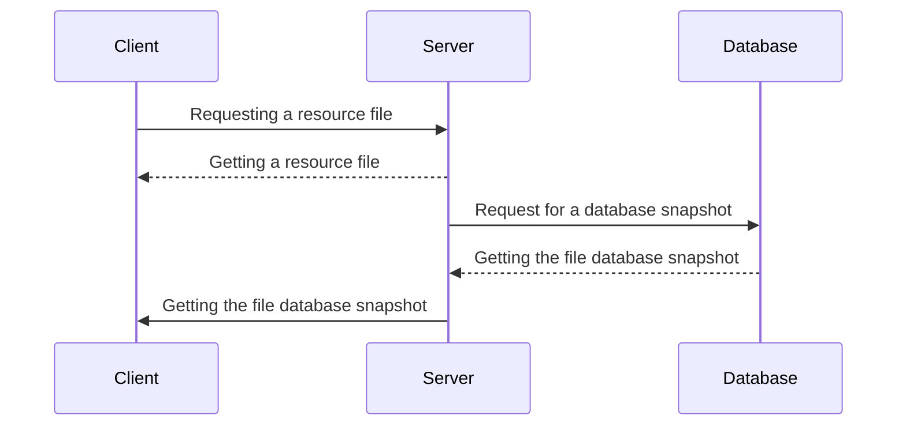

# :fire: Snapshot

##### _Snapshot anything quickly and efficiently_


>Utility to create snapshots of files and database of selected resources.

Snapshot - has both CLI (command-line interface). Snapshot, includes gzip, deduplication. Snapshot creates snapshots of the selected resource at a specified frequency.

The utility will allow:

- tracking changes;
- creating snapshots of only changed data;
- download the full archive of the resource for the selected date.

### Description of work

```go
go test ./...
go build
```

### Available commands

```go
// help
snt -h
// add resource
snt -a site.ru
// edit resource data
snt -e *project ID* *data field name* *new value*
// list all resources
snt -l
// delete the specified resource
snt -d *project ID*
// display all settings of the selected resource
snt -s *project ID*
// create a resource snapshot
snt -c *project ID*
// take snapshot of all projects
snt -cl
// list all available snapshots
snt -ls *project ID*
// request a specific project snapshot
snt -gs *project ID* *snapshot ID*
// request a file or an entire directory from a specific snapshot
snp -gsf *project ID* *snapshot ID* *directory*
// compare two pictures
snp -sc *project ID* *snapshot ID first* *snapshot ID second*
```



## ✨ _Git Flow_ ✨

- git pull - update local repository
- git branch - query the current branch
- git checkout `develop` - go to branch develop
- git checkout -b `feature-detail` - create and switch to a new branch

- branch `main` - release history
- branch `develop` - all functions
- branch `feature` - individual functions

- git push origin develop - pour into the thread

[Clue](https://www.atlassian.com/ru/git/tutorials/comparing-workflows/gitflow-workflow)